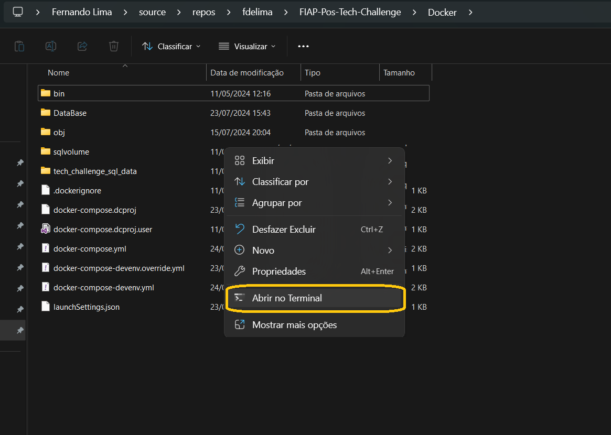
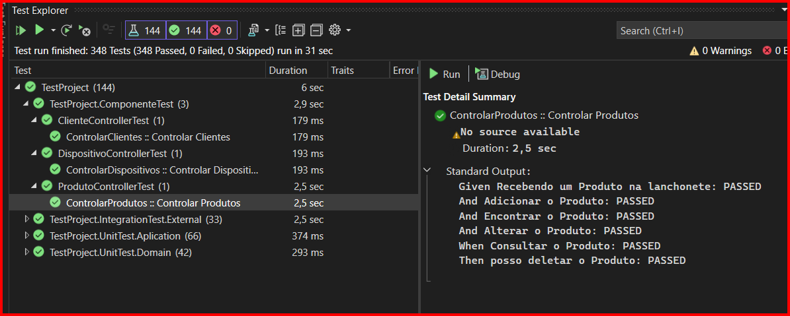
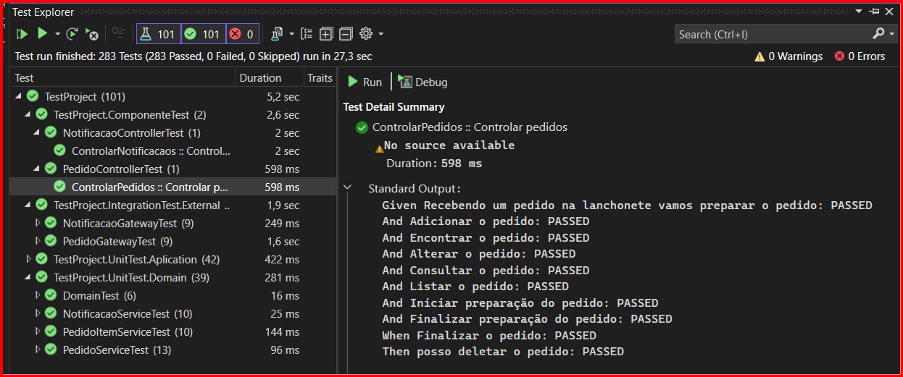
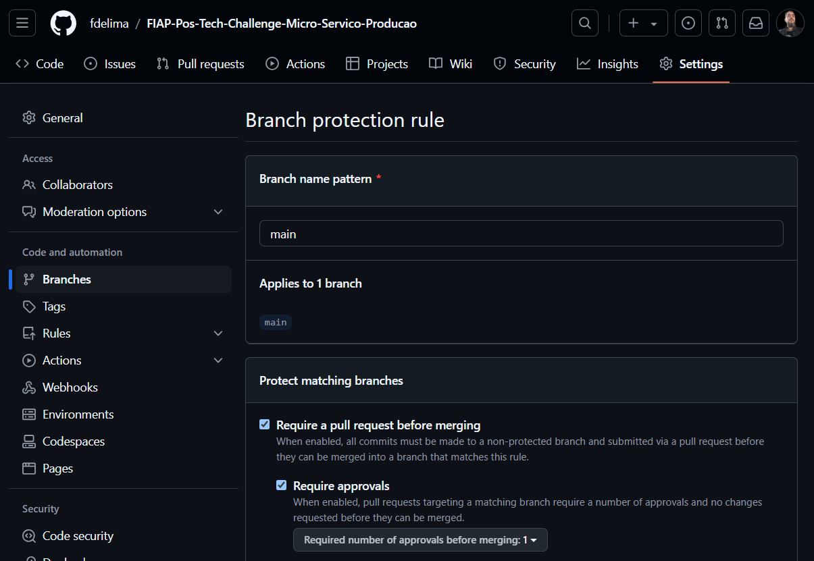

# FIAP-Pos-Tech-Challenge
Tech Challenge é o projeto da fase que englobará os conhecimentos obtidos em todas as disciplinas da fase. Esta é uma atividade que, em princípio, deve ser desenvolvida em grupo. Importante atentar-se ao prazo de entrega, pois trata-se de uma atividade obrigatória, uma vez que vale 90% da nota de todas as disciplinas da fase. 

## Como executar no visual studio 2022
* Certifique-se que o docker desktop esteja em execução
* Abra a solução (FIAP-Pos-Tech-Challenge.sln) com o visual studio 2022
* Start visual studio na opção docker-compose conforme imagem abaixo:


## Como executar manualmente no windows
* Certifique-se que o docker desktop esteja em execução
* Após o clone do projeto abra a pasta "Docker" no prompt de comando conforme imagem abaixo:

* Excute o commando abaixo:
```
docker compose up
```
# Navegação
* Documentação 
    * [https://localhost:8081/api-docs](https://localhost:8081/api-docs/index.html)
    * [http://localhost:8080/api-docs](http://localhost:8080/api-docs/index.html) 
* Swagger
    * [https://localhost:8081/swagger](https://localhost:8081/swagger/index.html)
    * [http://localhost:8080/swagger](http://localhost:8080/swagger/index.html) 


#
# Entregáveis FASE 4: [Wiki](https://github.com/fdelima/FIAP-Pos-Tech-Challenge/wiki)

Nesta fase vamos continuar trabalhando no projeto existente, e dando 
continuidade ao desenvolvimento do software para a lanchonete, teremos as 
seguintes melhorias e alterações: 
1. Refatore o projeto, separe-o em ao menos 3 (três) microsserviços. Alguns 
exemplos de serviços: 
    
    a. Pedido: responsável por operacionalizar o processo de pedidos, 
registrando os pedidos, retornando as informações necessárias 
para montar um pedido, listando os pedidos registrados e em 
processo de produção (visão de cliente).

    => [Repositório mico serviço de pedido](https://github.com/fdelima/FIAP-Pos-Tech-Challenge) :: Microsoft SqlServer 2019 (SQL)

    b. Pagamento: responsável por operacionalizar a cobrança de um 
pedido, registrando a solicitação de pagamento, recebendo o 
retorno do processador de pagamento e atualizando o status do 
pedido. 

    => [Repositório micro serviço de pagamento](https://github.com/fdelima/FIAP-Pos-Tech-Challenge-Micro-Servico-Pagamento) :: Microsoft SqlServer 2019 (SQL)

    c. Produção: responsável por operacionalizar o processo de 
produção do pedido, acompanhando a fila de pedidos (visão da 
cozinha), atualização de status de cada passo do pedido. 

    => [Repositório micro serviço de produção](https://github.com/fdelima/FIAP-Pos-Tech-Challenge-Micro-Servico-Producao) :: Microsoft SqlServer 2019 (SQL)

    Cadastro: Contruimos o micro serviço de cadastro para gerenciar os cadastros da aplicação com cliente, produto, imagens dos produto e dispositivos.

    => [Repositório micro serviço de produção](https://github.com/fdelima/FIAP-Pos-Tech-Challenge-Micro-Servico-Cadastro) :: MongoBb (NoSql)

Lembre-se de trabalhar com bancos de dados para cada aplicação. Use ao 
menos um banco de dados NoSQL e um SQL (obrigatório); caso queira fazer 
com mais bancos, você pode decidir quais utilizar.  

    => Utilizamos NoSql em nosso micro serviço de pagamento.

Os serviços devem se comunicar entre si, seja por chamada direta, 
mensagens em fila ou estratégias semelhantes. Um serviço não pode acessar o 
banco de dados de outro serviço, porque viola as regras de implementação de 
microsserviços.  

2. Ao refatorar, os microsserviços devem conter testes unitários. 

    a. Ao menos um dos caminhos de teste deve implementar BDD.  
    
    Implementamos BDD nos testes de componente.

    ## Micro serviço de Pedido
    
    
    ## Micro serviço de Cadastro
    
    
    

    ## Micro serviço de Produção
    
    

    ## Micro serviço de Pagamento
    

    b. Em todos os projetos, a cobertura de teste deve ser de 80%. 
    ## Micro serviço de Pedido
    
    
    [Veja aqui detalhes do Xunit Code Coverage](https://html-preview.github.io/?url=https://github.com/fdelima/FIAP-Pos-Tech-Challenge/blob/develop/TestProject/CodeCoverage/Report/index.html)

    ## Micro serviço de Cadastro
    
    
    [Veja aqui detalhes do Xunit Code Coverage](https://html-preview.github.io/?url=https://github.com/fdelima/FIAP-Pos-Tech-Challenge-Micro-Servico-Cadastro/blob/develop/TestProject/CodeCoverage/Report/index.html)

    ## Micro serviço de Produção
    
    
    [Veja aqui detalhes do Xunit Code Coverage](https://html-preview.github.io/?url=https://github.com/fdelima/FIAP-Pos-Tech-Challenge-Micro-Servico-Producao/blob/develop/TestProject/CodeCoverage/Report/index.html)

    ## Micro serviço de Pagamento
    
    
    [Veja aqui detalhes do Xunit Code Coverage](https://html-preview.github.io/?url=https://github.com/fdelima/FIAP-Pos-Tech-Challenge-Micro-Servico-Pagamento/blob/develop/TestProject/CodeCoverage/Report/index.html)

3. Seus repositórios devem ser separados para cada aplicação e devem 
respeitar as seguintes regras: 

    a. As branchs main/master devem ser protegidas, não permitindo commits 
diretamente. 
    
    ## Micro serviço de Pedido
    

    ## Micro serviço de Cadastro
    

    ## Micro serviço de Produção
    

    ## Micro serviço de Pagamento
    

    b. Pull Request para branch main/master, que deve validar o build da 
aplicação, e a qualidade de código via sonarqube ou qualquer outro 
serviço semelhante, cobrindo 70% de coverage no mínimo. 
    
    Utilizamos o própio dotnet test e pagamos os valore de code coverage direto do Xunit framework utilizado para desenvolvimento dos testes.
    
    ## Micro serviço de Pedido
    
    [Veja aqui detalhes do Xunit Code Coverage](https://html-preview.github.io/?url=https://github.com/fdelima/FIAP-Pos-Tech-Challenge/blob/develop/TestProject/CodeCoverage/Report/index.html)

    ## Micro serviço de Cadastro
    
    [Veja aqui detalhes do Xunit Code Coverage](https://html-preview.github.io/?url=https://github.com/fdelima/FIAP-Pos-Tech-Challenge-Micro-Servico-Cadastro/blob/develop/TestProject/CodeCoverage/Report/index.html)

    ## Micro serviço de Produção
    
    [Veja aqui detalhes do Xunit Code Coverage](https://html-preview.github.io/?url=https://github.com/fdelima/FIAP-Pos-Tech-Challenge-Micro-Servico-Producao/blob/develop/TestProject/CodeCoverage/Report/index.html)

    ## Micro serviço de Pagamento
    
    [Veja aqui detalhes do Xunit Code Coverage](https://html-preview.github.io/?url=https://github.com/fdelima/FIAP-Pos-Tech-Challenge-Micro-Servico-Pagamento/blob/develop/TestProject/CodeCoverage/Report/index.html)

    c. No Merge, o deploy de todos seus microsserviços devem ser executados, 
isso significa que todos os repositórios devem estar com CI/CD criados, e 
executados corretamente. 

Para a avaliação desta entrega, são esperados os seguintes artefatos: 

1. Um vídeo demonstrando:         
    
    a. O funcionamento da aplicação;         
    
    b. As atualizações efetuadas na arquitetura;          
    
    c. O processo de deploy de todos os microsserviços, mostrando o processo de teste funcionando como esperado; 
    
    d. Não é necessário mostrar as pipelines em execução, somente os checks (verdes) indicando que todos os passos foram executados corretamente. 

2. Os links para todos os repositórios usados com o código-fonte e a evidência de cobertura de testes. Essa evidência pode ser o link do serviço usado para testes ou a cópia da tela, mas deve estar no README do projeto, e a evidência deve ser por microsserviço.     
    
    1. Para validação do código-fonte da aplicação, precisamos que vocês deixem o projeto como privado e adicionem o usuário soat-architecture para que possamos ver o projeto.  A entrega deve ser feita em um arquivo com o nome e a identificação no Discord de todos os(as) alunos e alunas do grupo e os links para os itens acima. 

=> [Link Video Youtube](https://youtu.be/????)